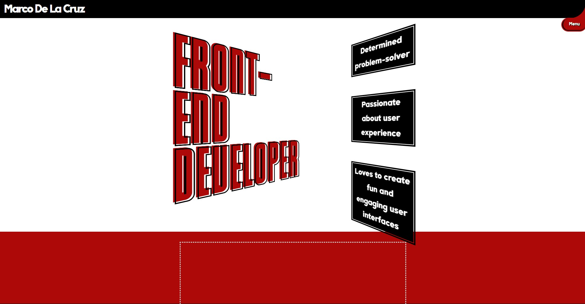

# Marco DLC -Front-End Web Developer Portfolio-

This is my personal website. It shows that I know how to create a
modern web portfolio and style it creatively. I attempted to stand out
with my opening animation of the header, website title, and bullet
points. I was inspired by the User Interface of the video game Persona
5, although I did not make mine as stylized, since I wanted to remain
professional and have a readable website, while still putting my own
touch in and making it mine.

### Live Website:
[marcodlc.com](https://www.marcodlc.com)

## Content:
### - Header 
It has the site name "MarcoDLC" and it opens up to reveal my full
name shortly after the opening title animation is complete. It closes
back up again when the user scrolls away from the opening title, and
even opens back up again when they scroll back up. When clicked on by
the user, it takes them to the top of the page.

### - Menu
The button has a black lining on the side that turns white when the
user hovers over it. When the user clicks on it, the white lining
continues upwards to the top, and the menu opens. This lining provides
a way for the shape of the button to be retained when the button is in
front of a red background of the same shade. The menu scrolls the user
to the corresponding section.

### - Splash
Easily, the most difficult to pull off in this project, the opening
title that the user is introduced to in a stylish animation that also
includes three bullet points to describe me.

### - About Me
A short section about me. It gets a border when being used on bigger 
screens so that it doesn't feel so lost in the big red background.

### - Skills
Two cards made with grid that either list my skills or tools that I use
and am familiar with. It uses icons associated from every skill and
tool for immediate recognition.

### - Projects
Cards displaying my portfolio work. I created those websites from
scratch either on React or regular HTML and Javascript. They each have
a button to take the user to the live website, as well as to the github
repos for those projects.

### - Resume
A small box with a big red download button so employers can download my
resume PDF.

### - Contact Form
A box with inputs for name, email, and a textarea for the message. The
submitted data is sent to Netlify Forms, which handles emailing me the
data. This is so it's more difficult for bots to find my email address,
however it also shows that I know how to communicate with the back-end.
It's something important for Front-end devs like me to know how to do.

### - Footer
It has my copyright with my name, and a small icon that when clicked,
links to my github profile page. I didn't put it anywhere more
noticeable because the github repos are already easily viewable, so
there isn't much reason for users to click on it unless they skipped
the 'source code' buttons in the Project section.

## Technology Used:
- VSCode
- Vite
- React
- JavaScript
- HTML
- CSS
- Git
- Netlify